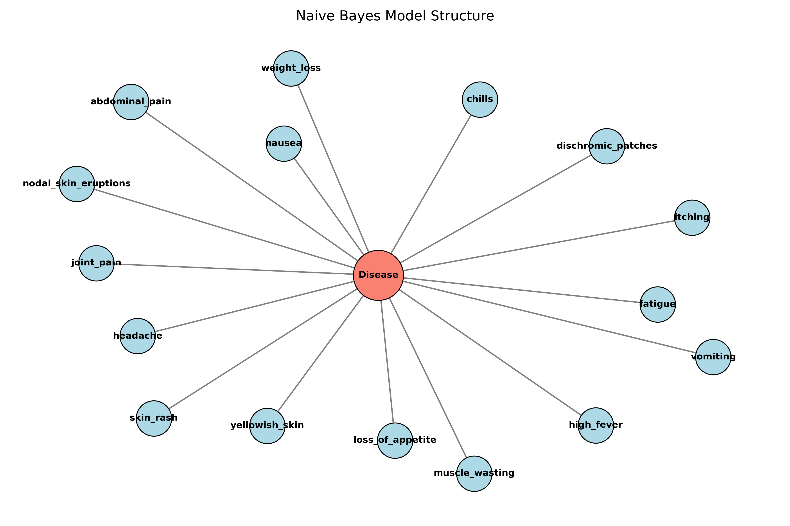
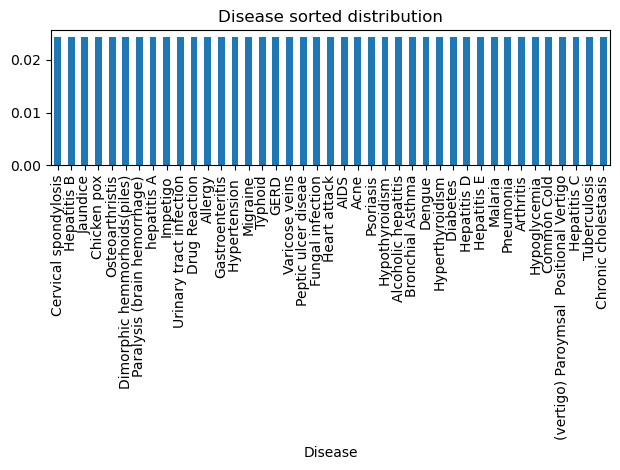

# Naive Bayes Disease Prediction

## Overview

This project implements a **Naive Bayes classifier** to predict diseases from patient symptom data. The model treats disease as a latent variable and symptoms as observed features, forming a probabilistic Bayesian framework.

---

## Model Structure

The model assumes conditional independence of symptoms given a disease:

* Disease → Symptoms (Naive Bayes assumption)
* 132 binary symptom features
* 41 disease classes



---

## Methodology

### Data Processing

* Converted symptom data into **binary feature vectors**
* Each patient is represented as a 132-dimensional vector (1 = symptom present, 0 = absent)

### Parameter Estimation

* Used **Maximum Likelihood Estimation (MLE)**
* Applied **Laplace Smoothing (α = 1)** to avoid zero probabilities

### Inference

Predictions are made using:

P(Disease | Symptoms) ∝ P(Disease) × ∏ P(Symptomᵢ | Disease)

---

## Results

* **Accuracy:** 100%
* **F1 Score:** 1.00



---

## Key Insight

Despite perfect accuracy, the dataset has critical issues:

* Highly duplicated symptom patterns (~93%)
* Perfect class balance across diseases
* Test samples overlap with training data

The model effectively **memorizes patterns**, leading to inflated performance.

---

## Takeaways

* Naive Bayes is effective for high-dimensional classification
* However, **data leakage can invalidate results**
* Highlights importance of proper dataset validation

---

## Tech Stack

* Python
* NumPy, pandas
* scikit-learn
* matplotlib

---

## Dataset

https://www.kaggle.com/datasets/itachi9604/disease-symptom-description-dataset

---

## How to Run

1. Download dataset from the link above
2. Place files in a `/data` folder
3. Run:

   ```
   mle.ipynb
   ```

---

## Note

This project is adapted from a collaborative academic assignment and presented here as a cleaned portfolio project.
